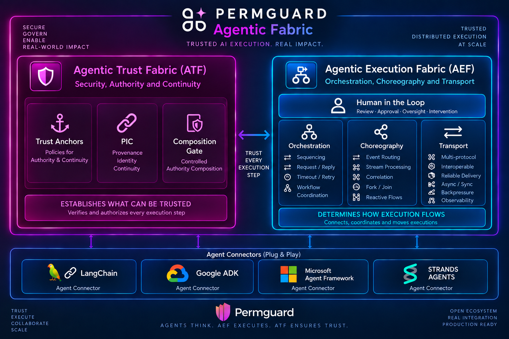

<!-- Copyright (c) 2022 Nitro Agility S.r.l. -->
<!-- SPDX-License-Identifier: Apache-2.0 -->

# Permguard Agentic Fabric

  

**Trusted execution for AI agents, under authority that never expands.**

Permguard Agentic Fabric is the layer where AI agents run and act on the outside world under Permguard's control.
Agents think and propose.
The fabric decides what may execute, moves the work across services, and keeps every step bound to the authority it inherited.

It is made of two parts.
The **Agentic Execution Fabric (AEF)** coordinates distributed execution.
The **Agentic Trust Fabric (ATF)** preserves trust and authority continuity across that execution.
