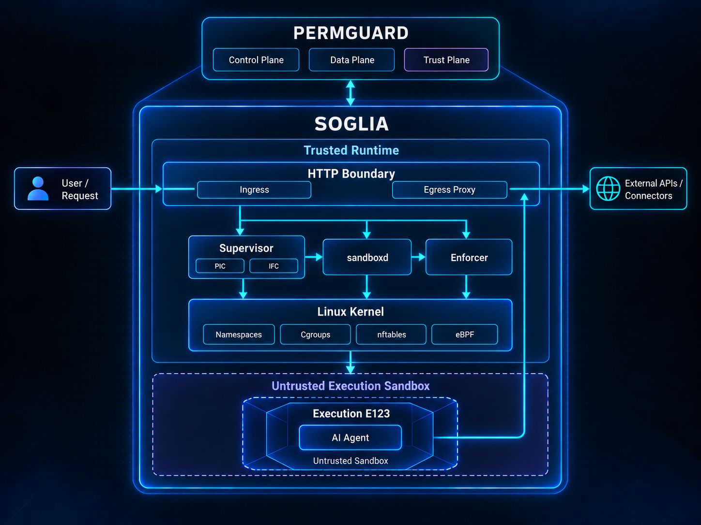

<!-- Copyright (c) 2022 Nitro Agility S.r.l. -->
<!-- SPDX-License-Identifier: Apache-2.0 -->

# Soglia

[](LICENSE)

<p align="center">
  
</p>

**Trusted execution for AI agents, under authority that never expands.**

Soglia is the runtime where AI agents run and act on the outside world under Permguard's control.
Agents think and propose.
Soglia decides what may execute, isolates the code that executes it, and lets its effects leave only through mediated boundaries.

## Two layers

Soglia works beside Permguard, and the two stay separate.

| Layer                  | What it is                                                                   |
| ---------------------- | ---------------------------------------------------------------------------- |
| Permguard Trust Fabric | Control Plane, Data Plane and Trust Plane: PIC, trust, policy and authority  |
| Soglia Runtime         | The agent execution runtime: isolation, mediation, lifecycle and enforcement |

Permguard decides and verifies authority.
Soglia creates and confines the concrete Execution that must obey it.
Soglia is the implementation of the Agentic Execution Fabric architecture.

## How an invocation runs

One request creates one fresh, isolated Execution.

```text
Caller
  -> ingress proxy
  -> Supervisor
  -> fresh sandbox (namespaces, cgroup, read-only rootfs)
  -> agent
  -> egress proxy -> allowed destination
  -> response buffered
  -> Execution destroyed
  -> response to Caller
```

The agent can reach the network only through the Soglia egress proxy.
When the Caller receives a successful response, the Execution that produced it is already gone.

## Status

Soglia is under development.
The first version, Phase 0, proves the execution loop and the mediated network path end to end.
It is not a production security release.

Phase 0 deliberately leaves out PIC, virtual authority, Permguard Trust Fabric integration, information-flow control, the Credential Anchor, TLS interception, gRPC, Connectors and eBPF.
Their interfaces exist, and fail explicitly if they are called.

Phase-0 `CONNECT` mediation authorizes the tunnel endpoint but does not provide L7 TLS identity enforcement.
Shared-IP/SNI-mismatch or domain-fronting-style behavior remains outside the Phase-0 security claim and is addressed by a later TLS mediation phase.

## Requirements

Soglia runs only on Linux, and the `soglia` binary builds only for Linux.
Only the portable crates, `soglia-core` and `soglia-proxy`, also build on macOS: they are plain logic, with no kernel dependency.
Every other crate stops with an explicit error when built for another system.

| Requirement                  | Why                                                  |
| ---------------------------- | ---------------------------------------------------- |
| Rust 1.97+                   | Build Soglia                                         |
| cgroup v2, delegated subtree | Per-Execution resource limits and teardown           |
| `nft` (nftables)             | Network policy for each Execution                    |
| `ip` (iproute2)              | Network namespaces, veth pairs, addresses and routes |
| `runc`                       | Start each Execution from an OCI bundle              |
| Task or Make                 | Run the project workflows                            |

On macOS or Windows, build and test the rest inside the Linux development container described below.

## Running

`soglia run` starts as root, starts its two privileged helpers, and then drops to the unprivileged user the configuration names.

```sh
soglia run -f examples/soglia.yaml
curl -X POST --data 'echo hello' http://127.0.0.1:8088/v1/execute/echo
```

Run it inside a cgroup subtree delegated to it.
[dev/systemd/soglia.service](dev/systemd/soglia.service) shows the unit, with `Delegate=yes`.

## Development

The repository exposes the same workflows through `Taskfile.yml` and `Makefile`.
All of them run on Linux, and inside the development container:

```sh
task check             # lint, headers, Phase-0 dependency check, supply chain, unit tests
task test:acceptance   # the privileged suite: T1-T10, H1-H4, and the backends on a real kernel
```

On macOS there are two ways to work.

| Where                              | What runs                                                                |
| ---------------------------------- | ------------------------------------------------------------------------ |
| Natively                           | `task test:portable`: lint and tests of `soglia-core` and `soglia-proxy` |
| In [.devcontainer/](.devcontainer) | Everything, with the editor and rust-analyzer running inside Linux       |

The devcontainer is built from [dev/linux/Dockerfile](dev/linux/Dockerfile), the same image `dev/linux/run.sh` and the CI use.
Outside an editor, `dev/linux/run.sh make check` runs the full gate in that image.

`task test:acceptance` runs the privileged suite in place inside the devcontainer, and in a fresh privileged container anywhere else, a Linux host included, because the suite creates network namespaces, links and nftables tables.
That container has its own cgroup namespace, where [dev/linux/cgroup-init.sh](dev/linux/cgroup-init.sh) delegates a subtree to Soglia the way a systemd unit would.

## License

Apache-2.0.
See [LICENSE](LICENSE).
